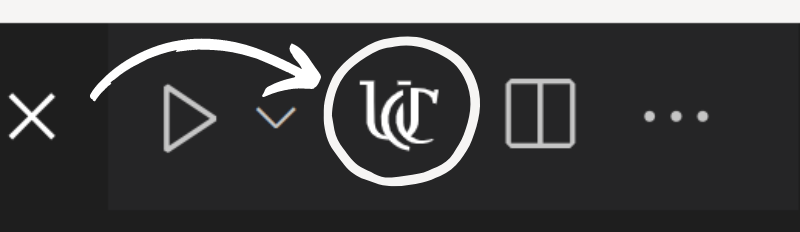
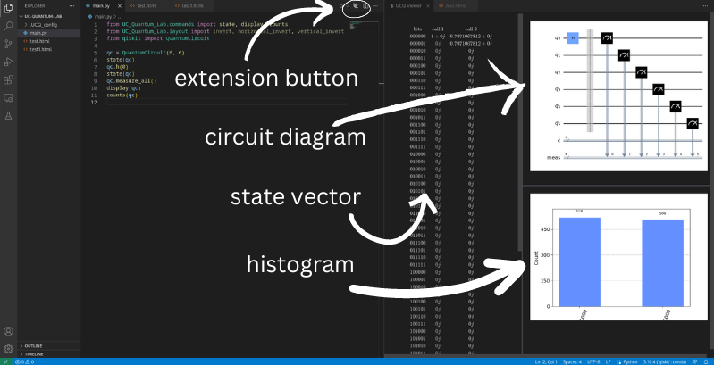

# uc-quantum-lab
**PLEASE** report any bugs, features that you may want, or anything else in the github. They will be attended to. This is still an early release so feedback is appreciated.

This extension provides a UI that allows the results of a quantum circuit created and simulated with qiskit to be presented cleanly and easily. This extension operates with the required python library [UC-Quantum-tools](https://github.com/UC-Advanced-Research-Computing/UC-Quantum-tools).

### Notes to User
- All images and assets are saved in the ".UCQ_config" directory. They can be copied if you so choose. Also, the latex code for the statevector is in the layout.json file in this directory (if you want to copy to an actual latex file).
- This extension no longer handles pip installs for you (to many edge case bugs possible that I can not account for). So you must now install the required package. It is in the "Quick Start" section below.

## Quick Start
1. Open a folder in vscode.
2. Install the required python package
    ```
    pip install UC-Quantum-tools
    ```
3. Set python interpreter to your desired one to via the python extension for vscode. <!-- The python package will be installed for this interpreter. -->
    - To do this you can either run the following command in the command  palette:
        ```
        python.setInterpreter
        ```
        **or** in the lower bar you can select the "python interpreter" button.
    - For more help see: [using python environments](https://marketplace.visualstudio.com/items?itemName=ms-python.python#:~:text=Set%20up%20your%20environment)
4. Open the command palette and run 
    ```
    uc-quantum-lab.execute
    ```
    **or**, if you have an active editor with a python file in it, click the UC logo at the top of the file.
5. Answer the prompts. These only show up if the directory has not been initialized yet.
6. Every time you want to run the python file and have its output updated in the viewer, click the UC logo in the editor and it will execute your file with the python extension. You could also set a key-bind to do this.
    - See [examples/python](https://github.com/UC-Advanced-Research-Computing/UC-Quantum-Lab/tree/main/examples/python) for example python files that can be used with this extension.

## Features
Can display a lot of information about the circuit including (see [UC-Quantum-tools](https://github.com/UC-Advanced-Research-Computing/UC-Quantum-tools) for a complete command list):
- The statevector of the circuit an arbitrary number of times from anywhere in the circuit as long as there are no measurements. (to show more than one just call the `state` function more than once).
    - **Example**: (in a python file)
        ```python
        # make a circuit
        state(circuit)
        # do more stuff to the circuit
        state(circuit)
        ```
        The state vector will be displayed from both of the above calls.
- An image of the circuit an arbitrary number of times from anywhere in the circuit. (to show more than one just call the `display` function more than once). This function can also display a matplotplib figures.
    - **Example**: (in a python file)
        ```python
        # make a circuit
        display(circuit)
        # do more stuff to the circuit
        display(circuit)
        # or
        import matplotlib.pyplot as plt
        fig = plt.figure()
        # fill in the figure
        display(fig)
        # or
        plt.plot(x, y)
        display()
        ```
        The circuit will be displayed from both of the above calls.
- A histogram representing the results of the execution of the circuit an arbitrary number of times. Must be used after the circuit is measured. (to show more than one just call the `counts` function more than once)
    - **Example**: (in a python file)
        ```python
        # make a circuit
        # measure the circuit
        counts(circuit)
        # make another circuit
        # do stuff to the new circuit
        counts(circuit)
        ```
        A histogram will be displayed from both of the above calls.



This extension builds off of the python extension for vscode (see [python extension](https://code.visualstudio.com/docs/languages/python)). The python extension provides the python interpreter functionality for this extension.
## Requirements
- Python interpreter and pip on your device. Here is a good tutorial for installing python [python tutorial](https://realpython.com/installing-python/).
    - **NOTE**: we strongly recommend using anaconda for this (see [anaconda](https://www.anaconda.com/)) and it *must* be installed as user *not* as root (this is the better way to do it anyway). For a good tutorial on anaconda go to [anaconda tutorial](https://www.upgrad.com/blog/python-anaconda-tutorial/).
- Python extension, for install instructions and a tutorial see [python extension](https://code.visualstudio.com/docs/languages/python). It should be auto installed by this extension if it is not already installed.

## Extension Commands
This extension contributes the following commands:
- `uc-quantum-lab.execute`: execute the extension, will detect if the directory is initialized or not and initializes it if need be. It will also open up a webview panel where it will display content. *If you only ever run this command you should be fine*.
    - **NOTE:** This should probably be the only command you ever have to run. You might have to run the `uc-quantum-lab.reinit` command if you encounter an error.
- `uc-quantum-lab.init`: setup the current workspace path for this extension.
- `uc-quantum-lab.reinit`: if you encounter an error try running this, it will wipe the extension setup in the workspace and setup it up again.

## Examples
See the examples folder, it contains the following:
- python:
    - examples of python files using the python library required for this extension
- json
    - examples using the json to html converter of this extension (you could write some python code to output to json then have this extension render it)

## On json to html converter
See [HTMLDOCS.md](https://github.com/UC-Advanced-Research-Computing/UC-Quantum-Lab/blob/main/HTMLDOCS.md).

## Known Issues
- The horizontal scroll bar of a sub-window is sometimes hidden by a scroll bar of the parent window.
    - It you encounter this just scroll down in the parent window and it should be there. (If someone who is good at JavaScript wants to help fix this that would be greatly appreciated).
- Since this extension is so reliant on the python extension see [python extension issues](https://github.com/microsoft/vscode-python/issues) for current issues and solutions.

## Credits
- https://github.com/Tom-Rawlings/Resizable.js for the amazing js library that made the UI possible.
- https://github.com/jquery/jquery for a feature rich api that I use to dynamically load html.
- https://github.com/mathjax/MathJax for a feature rich api that allows latex to displayed in html.

## Release Notes
See changelog for the latest on this extension